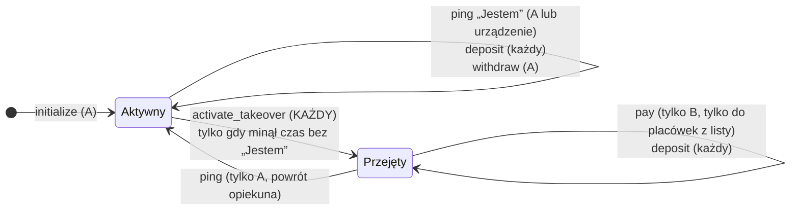
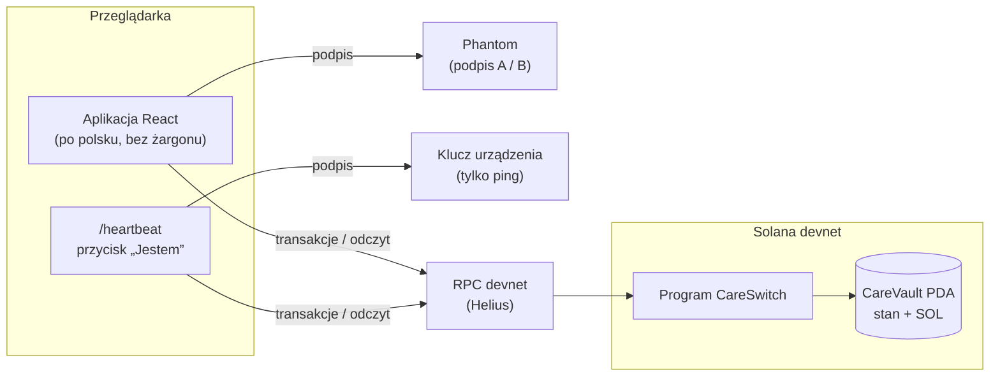

# CareSwitch

**Fundusz na leczenie osoby zależnej, który przechodzi na opiekuna zastępczego bez banku, notariusza i sądu, a zastępca i tak nie dostaje pieniędzy do ręki.**

> Superteam Poland · wyzwanie *„Finance Without Intermediaries”* · Solana devnet

| | |
|---|---|
| **Program (devnet)** | [`CmMRpxgNfSqx69y3tXV4hvVkh7RztYK5Et1SrycikQM7`](https://explorer.solana.com/address/CmMRpxgNfSqx69y3tXV4hvVkh7RztYK5Et1SrycikQM7?cluster=devnet) |
| **Stos** | Anchor 1.1.2 (Rust) · React 19 + Vite · Phantom (Wallet Standard) |
| **Testy** | 13 testów programu (Surfpool, cofanie zegara) · pełny scenariusz sprawdzony na devnecie |

---

## Spis treści

1. [Problem i odbiorca](#1-problem-i-odbiorca)
2. [Rozwiązanie w jednym akapicie](#2-rozwiązanie-w-jednym-akapicie)
3. [Moment, w którym pośrednik przestaje być potrzebny](#3-moment-w-którym-pośrednik-przestaje-być-potrzebny)
4. [Reguły on-chain: instrukcja → reguła → kto może](#4-reguły-on-chain-instrukcja--reguła--kto-może)
5. [Scenariusz demo](#5-scenariusz-demo)
6. [Architektura](#6-architektura)
7. [Uruchomienie](#7-uruchomienie)
8. [Wyzwania techniczne, które rozwiązaliśmy](#8-wyzwania-techniczne-które-rozwiązaliśmy)
9. [Ograniczenia: mówimy o nich wprost](#9-ograniczenia-mówimy-o-nich-wprost)
10. [Co dalej](#10-co-dalej)

---

## 1. Problem i odbiorca

**Dla kogo:** rodzice i opiekunowie osób z głęboką niepełnosprawnością oraz opiekunowie zastępczy, którzy mają przejąć opiekę, gdy główny opiekun nagle nie może jej sprawować.

Rodzic dorosłego dziecka z głęboką niepełnosprawnością odkłada pieniądze na leki i rehabilitację. Pytanie, które nie daje mu spać: **co się stanie z tymi pieniędzmi i z opieką, jeśli jutro trafię do szpitala albo umrę?**

Dziś odpowiedź brzmi: **pośrednicy, którzy działają wolno albo wcale.**

| Pośrednik | Jak działa dziś | Problem |
|---|---|---|
| **Bank** | Pełnomocnictwo do rachunku **wygasa ze śmiercią** mocodawcy. Dyspozycja wkładem na wypadek śmierci jest dostępna tylko dla najbliższej rodziny i ograniczona do **20-krotności przeciętnego wynagrodzenia**. | Środki zostają zamrożone dokładnie wtedy, gdy są najbardziej potrzebne. Opiekun zastępczy spoza rodziny nie dostaje nic. |
| **Sąd opiekuńczy** | Ustanowienie kuratora lub opiekuna prawnego. | **Tygodnie do miesięcy.** W tym czasie leki i rehabilitacja i tak muszą być opłacone. |

**Co zmienia usunięcie pośrednika:** zasady przekazania ustala opiekun główny z góry, a egzekwuje je program na blockchainie. Przejęcie następuje **w ciągu sekund** od upływu ustalonego czasu, a nie po tygodniach w sądzie. Przy tym **opiekun główny nie musi w pełni ufać zastępcy**: zastępca może płacić wyłącznie zatwierdzonym placówkom.

## 2. Rozwiązanie w jednym akapicie

Opiekun główny (**A**) zakłada fundusz: wpłaca SOL do skarbca programu, wskazuje opiekuna zastępczego (**B**), czas bezczynności i listę do 3 zatwierdzonych placówek (np. apteka, ośrodek rehabilitacji). A regularnie potwierdza obecność przyciskiem **„Jestem”**, w aplikacji albo urządzeniem przy łóżku. Jeśli „Jestem” nie przyjdzie w zadanym czasie, **każdy** może aktywować przejęcie. Po przejęciu B **nie dostaje pieniędzy do ręki**: może płacić wyłącznie placówkom z listy. Gdy A wróci i kliknie „Jestem”, odzyskuje pełną kontrolę.



## 3. Moment, w którym pośrednik przestaje być potrzebny

Pośrednik znika w dwóch miejscach i **oba są w programie on-chain**, a nie w aplikacji czy na serwerze:

**`activate_takeover`: przejęcie decyduje zegar, nie urzędnik.** Instrukcję może wywołać ktokolwiek, a program sprawdza tylko czas:

```rust
pub fn handle_activate_takeover(ctx: Context<ActivateTakeover>) -> Result<()> {
    let vault = &mut ctx.accounts.vault;
    let now = Clock::get()?.unix_timestamp;

    require!(vault.status == Status::Active, CareError::NotActive);
    require!(now - vault.last_heartbeat > vault.timeout_secs, CareError::NotExpired);

    vault.status = Status::Takeover;
    Ok(())
}
```

**`pay`: zaufanie zastąpione regułą.** Zastępca podpisuje płatność, ale program wypuści pieniądze tylko do placówki z listy ustalonej przez A:

```rust
require!(vault.status == Status::Takeover, CareError::NotInTakeover);
require!(vault.allowlist.contains(recipient.key), CareError::RecipientNotAllowed);
```

Strona internetowa **celowo nie blokuje** wpisania dowolnego adresu odbiorcy. Próba zapłaty sobie zostaje odrzucona przez program (`RecipientNotAllowed`), nie przez interfejs. Bez backendu nie ma też serwera, którego właściciel mógłby podmienić zastępcę albo zablokować wypłatę.

## 4. Reguły on-chain: instrukcja → reguła → kto może

Stan funduszu to jedno konto PDA `CareVault`, które **jest jednocześnie skarbcem** (trzyma SOL).
Seeds: `["care", owner, vault_id (u64 LE)]`.

| Instrukcja | Kto podpisuje | Reguła egzekwowana przez program | Efekt |
|---|---|---|---|
| `initialize(vault_id, beneficiary, heartbeat_key, timeout_secs, allowlist)` | **A** | `timeout_secs > 0`; lista 1–3 placówek; **na liście nie może być B, A ani samego funduszu** | tworzy fundusz, `status = Aktywny`, start licznika |
| `deposit(amount)` | **każdy** | `amount > 0` | przelew SOL do funduszu (CPI do System Program) |
| `ping()` „Jestem” | **A** lub **klucz urządzenia** | urządzenie: tylko gdy `Aktywny`; A: zawsze, a w stanie `Przejęty` **przywraca** `Aktywny` | reset licznika |
| `activate_takeover()` | **każdy** | `Aktywny` **i** `now − last_heartbeat > timeout` | `status = Przejęty` |
| `pay(amount)` | **tylko B** (`has_one = beneficiary`) | `Przejęty`; odbiorca **na liście**; w funduszu zostaje minimum na rent | SOL z funduszu → placówka |
| `withdraw(amount)` | **tylko A** (`has_one = owner`) | `Aktywny`; zostaje minimum na rent | SOL z funduszu → A |

**Kto ma jaką władzę:**

| Rola | Może | Nie może |
|---|---|---|
| **A**, opiekun główny | założyć, wpłacić, wypłacić (gdy aktywny), „Jestem”, odzyskać kontrolę po przejęciu | – |
| **Urządzenie** (przycisk, telefon, ESP32) | tylko „Jestem”, i tylko gdy fundusz jest aktywny | ruszyć środki, cofnąć przejęcie, zmienić ustawienia |
| **B**, opiekun zastępczy | po przejęciu płacić placówkom z listy | wypłacić sobie, płacić przed przejęciem, zmienić listę |
| **Każdy** | wpłacić, aktywować przejęcie po upływie czasu | cokolwiek innego |
| **Autorzy projektu** | nic po zablokowaniu aktualizacji programu (`upgrade authority = none`) | – |

**Błędy programu** i komunikaty, które widzi użytkownik:

| Kod | Komunikat w aplikacji |
|---|---|
| `NotAuthorized` | Nie masz uprawnień do tej operacji. |
| `NotExpired` | Opiekun jest jeszcze aktywny – czas jeszcze nie minął. |
| `NotInTakeover` | Przejęcie nie zostało aktywowane. |
| `NotActive` | Fundusz jest w trybie przejęcia. |
| `RecipientNotAllowed` | Odbiorca spoza listy zatwierdzonych placówek. |
| `InsufficientFunds` | Za mało środków w funduszu. |
| `InvalidConfig` | Nieprawidłowe ustawienia funduszu. |

> **Dlaczego `sub_lamports`/`add_lamports`, a nie przelew przez System Program?** System Program nie może obciążyć konta należącego do innego programu. Fundusz jest kontem programu CareSwitch, więc program przesuwa lamporty bezpośrednio i zawsze zostawia minimum na rent, żeby konto nie zniknęło.

## 5. Scenariusz demo

Czas bezczynności: **30 s**. Dwa konta w Phantomie: A i B.

| # | Kto | Akcja | Co widać |
|---|---|---|---|
| 1 | A | Zakłada fundusz (B, 30 s, Apteka + Ośrodek) i wpłaca 2 SOL | saldo ~2 SOL, transakcje w Explorerze |
| 2 | A | „Jestem” | licznik wraca do pełnego czasu |
| 3 | – | Cisza | licznik spada do 0:00 |
| 4 | B (albo ktokolwiek) | „Aktywuj przejęcie” | znaczek **Przejęty** |
| 5 | B | Płaci Aptece 0,5 SOL | ✓, saldo Apteki rośnie |
| 6 | B | Próbuje zapłacić sobie | ✕ **„Odbiorca spoza listy zatwierdzonych placówek”**, odrzucone przez program |
| 7 | A | „Jestem” | znaczek wraca na **Aktywny** |
| 8 | – | Explorer: program | **Upgradeable: No** |

**Adresy demo (devnet):**

| Rola | Adres |
|---|---|
| Apteka | `5xrBGGYjcpMeBxDzo6hSpN5NVWqXNRe4Ts5x3r6yJmVi` |
| Ośrodek rehabilitacji | `69brS9rQ7oAP6sVvcMUvpWmvLDVenbGsSkpKuLeMkuNv` |
| Klucz urządzenia „Jestem” | `F849H9pe12xYkC5k5enZpS4ePsiWJC3LL2d29jtYxPEG` |

## 6. Architektura



Nie ma backendu. Aplikacja tylko buduje transakcje i czyta stan funduszu; **wszystkie reguły są w programie.**

```
careswitch/
├── program/                         Anchor workspace
│   ├── programs/careswitch/src/
│   │   ├── lib.rs                   punkty wejścia instrukcji
│   │   ├── state.rs                 CareVault, Status, bezpieczne wysyłanie lamportów
│   │   ├── error.rs                 CareError
│   │   └── instructions/            initialize, deposit, ping, activate_takeover, pay, withdraw
│   ├── tests/careswitch.ts          13 testów (Surfpool + cofanie zegara)
│   └── scripts/
│       ├── seed-demo.ts             zakłada fundusz demo i zasila klucze demo
│       ├── create-nonces.ts         konta durable nonce dla portfeli (patrz §8)
│       ├── inspect.ts               stan funduszu + zegar sieci vs lokalny
│       ├── start-local.sh           lokalny łańcuch Surfpool + deploy + seed
│       └── rpc-proxy.mjs            HTTP + WebSocket na jednym porcie (devcontainer)
├── presence/agent.ts                agent obecności na macOS: „Jestem”, gdy iPhone jest w zasięgu Bluetooth
└── app/                             Vite + React
    └── src/
        ├── pages/Main.tsx           panel opiekuna, status, panel zastępcy, historia
        ├── pages/Heartbeat.tsx      strona-przycisk „Jestem” dla urządzenia
        ├── lib/program.ts           klient Anchor, durable nonce, obsługa blockhasha
        ├── lib/errors.ts            błędy programu i portfela → zdania po polsku
        └── hooks/                   odpytywanie funduszu, wyszukiwanie funduszu, historia tx
```

**Jak aplikacja znajduje fundusz bez bazy danych:** pola `owner`, `beneficiary` i `heartbeat_key` leżą pod stałymi offsetami konta (8, 40, 72 bajty). Aplikacja pyta RPC o konta programu z filtrem `memcmp`, więc A, B i urządzenie widzą swój fundusz od razu po podłączeniu. Działa też link `?owner=…&id=…`.

## 7. Uruchomienie

### Wymagania

- Anchor CLI **1.1.2**, Rust **1.95.0**, Solana CLI, [Surfpool](https://surfpool.run)
- Node.js **≥ 22**
- Najprościej: devcontainer z [repo bootcampu](https://github.com/matzayonc/solana-live-course-2026) (ma wszystko powyżej)

### Program: build i testy

```bash
cd program
npm install
anchor build
anchor test          # uruchamia Surfpool i 13 testów
```

Testy nie czekają w czasie rzeczywistym, tylko przesuwają zegar łańcucha kodem `surfnet_timeTravel` z Surfpoola. Scenariusz przejęcia trwa więc poniżej sekundy.

### Deploy na devnet

```bash
solana config set --url devnet
anchor deploy --provider.cluster devnet
anchor idl init <PROGRAM_ID> -f target/idl/careswitch.json --provider.cluster devnet
```

### Aplikacja

```bash
cd app
npm install
cp .env.example .env.local     # uzupełnij zmienne (tabela niżej)
npm run sync-idl               # skopiuj IDL i typy z ../program/target
npm run dev                    # http://localhost:5173
```

| Zmienna | Opis |
|---|---|
| `VITE_RPC` | Adres RPC devnetu. **Zalecany prywatny endpoint** (np. darmowy Helius), bo publiczny `api.devnet.solana.com` szybko zwraca 429 |
| `VITE_HEARTBEAT_SECRET` | Sekret klucza urządzenia (tablica JSON z `solana-keygen`). **Tylko devnet**, trafia do kodu strony |
| `VITE_APTEKA`, `VITE_OSRODEK` | Adresy placówek wstawiane do formularza |
| `VITE_NONCE_BASE` | Adres portfela, który zakładał konta nonce (`create-nonces.ts`) |

### Przygotowanie demo

```bash
cd program
# konta durable nonce dla portfeli, które będą podpisywać w Phantomie
RPC=<devnet-rpc> node --experimental-strip-types scripts/create-nonces.ts <adres A> <adres B> <adres urządzenia>

# opcjonalnie: fundusz demo zakładany z portfela CLI
RPC=<devnet-rpc> TIMEOUT=30 DEPOSIT=2 BENEFICIARY=<adres B> node --experimental-strip-types scripts/seed-demo.ts

# podgląd stanu funduszu i różnicy zegara sieci względem lokalnego
RPC=<devnet-rpc> OWNER=<adres A> ID=<numer funduszu> node --experimental-strip-types scripts/inspect.ts
```

### Agent obecności: „Jestem”, dopóki telefon jest w pobliżu (macOS + iPhone)

Opiekun nie musi pamiętać o klikaniu. Laptop (w domu: Raspberry Pi / ESP32) wysyła „Jestem”, dopóki telefon opiekuna jest w zasięgu Bluetooth. Gdy telefon zniknie, agent przestaje, a **odliczanie biegnie on-chain**. Wyłączenie laptopa nie zatrzyma więc przejęcia, a jego klucz potrafi tylko pingować.

1. iPhone: aplikacja **LightBlue** → *Virtual Devices* → **+** → np. *Heart Rate* (nazwa np. `CareSwitch`), aplikacja otwarta na ekranie.
2. Mac:
   ```bash
   cd presence && npm install
   npm run scan                         # znajdź telefon: nazwa albo UUID usługi (np. 180d)
   PHONE=CareSwitch npm start           # albo PHONE=180d
   ```
3. Agent pilnuje najnowszego funduszu z kluczem urządzenia (`keys/heartbeat.json`) i pinguje co ⅓ czasu bezczynności, gdy sygnał ≥ `RSSI_MIN` (domyślnie −75 dBm; utrata sygnału po `GRACE` = 8 s).

### W całości lokalnie (bez devnetu)

W devcontainerze:

```bash
bash program/scripts/start-local.sh                       # Surfpool + deploy + fundusz demo
cd app && VITE_RPC=http://localhost:8899 npm run dev      # na hoście
```

## 8. Wyzwania techniczne, które rozwiązaliśmy

Rzeczy, o które realnie się potknęliśmy podczas testów z Phantomem na devnecie. Każda kończyła się tym samym, mało mówiącym błędem `Blockhash not found`.

1. **Limity publicznego RPC.** `api.devnet.solana.com` blokuje całe IP (429), także na współdzielonym Wi-Fi i hotspocie operatora. Rozwiązanie: prywatny endpoint, odpytywanie jednym zapytaniem co 3 s i wstrzymywanie odpytywania w nieaktywnej karcie.
2. **Blockhash na devnecie żyje ~33 s.** Zmierzyliśmy ~4,5 bloku/s × 150 bloków ważności. Phantom potrzebował ~35 s na zwrócenie podpisu, więc transakcje wygasały. Rozwiązanie: **durable nonce**. Każdy portfel dostaje konto nonce (adres wyliczany deterministycznie przez `createWithSeed`), a transakcja zaczyna się od `AdvanceNonce` i **nie wygasa**.
3. **Phantom dokleja instrukcje priority fee na początek transakcji.** To przesuwało `AdvanceNonce` z pierwszego miejsca i sieć przestawała rozpoznawać transakcję jako nonce'ową. Rozwiązanie: aplikacja sama ustawia `ComputeBudget` zaraz po `AdvanceNonce`, więc portfel nie ma czego dopisywać. Jeśli portfel mimo to zmieni kolejność instrukcji, aplikacja pokazuje to w komunikacie.
4. **Węzły RPC za load balancerem bywają w tyle.** Jeśli błąd nie wynika z wygaśnięcia, aplikacja ponawia wysłanie tych samych podpisanych bajtów, bez ponownego pytania portfela.
5. **Zegar sieci ≠ zegar komputera.** Licznik w interfejsie ma 3 s zapasu, a sama reguła czasu (`>`) jest sprawdzana on-chain.

## 9. Ograniczenia: mówimy o nich wprost

- **„Jestem” to nie dowód życia.** Ktoś inny może nacisnąć przycisk (blokuje przejęcie, ale nie ruszy środków), a fałszywy alarm jest możliwy, gdy A po prostu zapomni. Dlatego A może w każdej chwili wrócić, a B w międzyczasie płaci tylko placówkom z listy.
- **Posiadacz urządzenia może pingować bez końca.** Odsuwa wtedy przejęcie, ale nie ma dostępu do pieniędzy.
- **Off-ramp.** W produkcji fundusz byłby w stablecoinie (USDC). Placówki muszą go przyjmować albo wymieniać na PLN.
- **Prawo spadkowe.** Środki opiekuna wchodzą w spadek. Projekt nie rozwiązuje tej kwestii prawnej.
- **Devnet i SOL zamiast stablecoina; brak audytu.** To prototyp z hackathonu.
- **Klucz urządzenia jest w kodzie strony `/heartbeat`.** Akceptowalne na devnecie (klucz umie tylko pingować), w produkcji klucz siedzi w urządzeniu.
- **Dead man's switch to znany wzorzec.** Nasza wartość dodana to lista placówek („A nie musi ufać B”), kontekst opieki i możliwość powrotu A.

## 10. Co dalej

- **USDC** zamiast SOL (`token_interface::transfer_checked` z seedami PDA).
- **Limity dzienne** płatności zastępcy.
- **Multisig 2 z 3** po stronie zastępców (np. B + pielęgniarka + kurator).
- **ESP32 w dozowniku leków:** „Jestem” wysyłane automatycznie przy wyjęciu dawki.
- **Wpłaty od darczyńców** z publicznym wglądem w każdą wydaną złotówkę: zbiórki, które same rozliczają się z wydatków.

---

<sub>Zbudowane podczas hackathonu Superteam Poland na bazie materiałów z [bootcampu](https://matzayonc.github.io/stpl-bootcamp).</sub>
