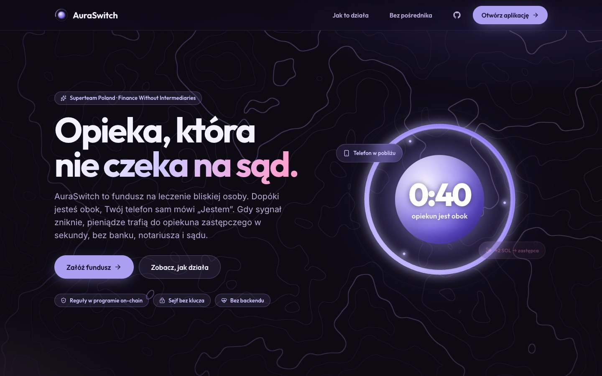
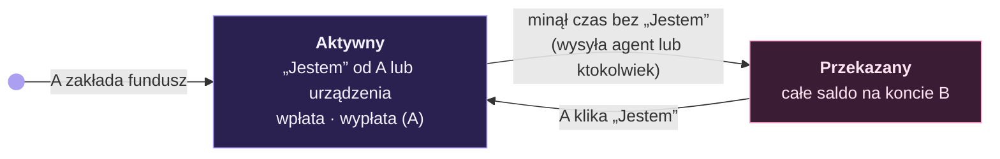
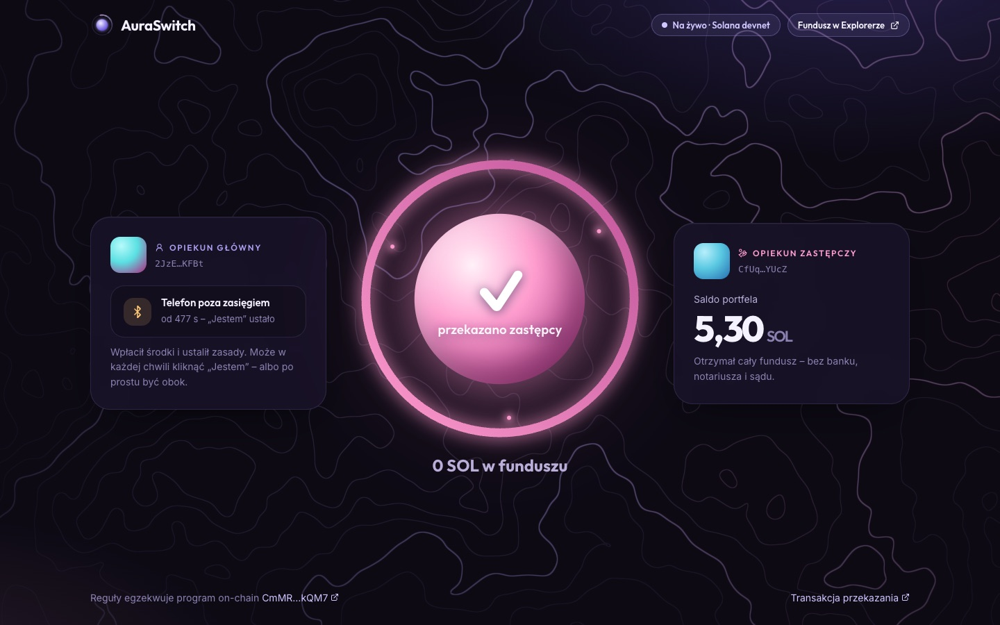
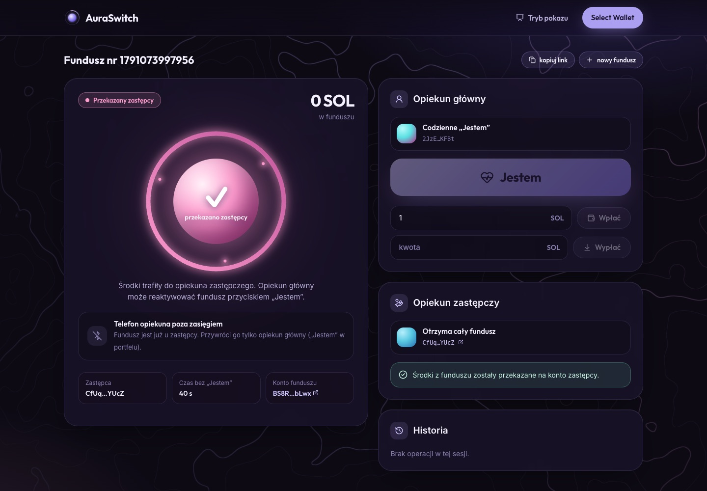
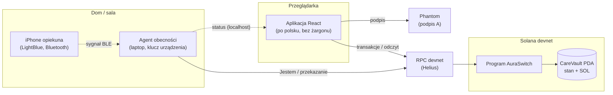

# AuraSwitch

**Fundusz na leczenie osoby zależnej, który sam przechodzi na opiekuna zastępczego, gdy opiekun główny przestaje dawać znak życia. Bez banku, notariusza i sądu.**

> Superteam Poland · wyzwanie *„Finance Without Intermediaries”* · Solana devnet

| | |
|---|---|
| **Program (devnet)** | [`CmMRpxgNfSqx69y3tXV4hvVkh7RztYK5Et1SrycikQM7`](https://explorer.solana.com/address/CmMRpxgNfSqx69y3tXV4hvVkh7RztYK5Et1SrycikQM7?cluster=devnet) |
| **Stos** | Anchor 1.1.2 (Rust) · React 19 + Vite · motion (animacje) · WebGL · Phantom (Wallet Standard) · agent Bluetooth na macOS |
| **Testy** | 9 testów programu (Surfpool, cofanie zegara) · pełny scenariusz z Phantomem, agentem Bluetooth i iPhone’em nagrany na żywo na devnecie |
| **Wideo** | 2 min, nagrywane automatycznie (Playwright + ffmpeg) z prawdziwych transakcji – patrz [§7](#nagranie-wideo-zgłoszeniowego-presentation) |
| **Status** | Program jest jeszcze aktualizowalny (trwa hackathon). Przed oddaniem zgłoszenia blokujemy aktualizacje (`solana program set-upgrade-authority <ID> --final`), po czym Explorer pokazuje **Upgradeable: No** |



---

## Spis treści

1. [Problem i odbiorca](#1-problem-i-odbiorca)
2. [Rozwiązanie w jednym akapicie](#2-rozwiązanie-w-jednym-akapicie)
3. [Moment, w którym pośrednik przestaje być potrzebny](#3-moment-w-którym-pośrednik-przestaje-być-potrzebny)
4. [Reguły on-chain: instrukcja → reguła → kto może](#4-reguły-on-chain-instrukcja--reguła--kto-może)
5. [Scenariusz demo i zrzuty ekranu](#5-scenariusz-demo-i-zrzuty-ekranu)
6. [Architektura](#6-architektura)
7. [Uruchomienie](#7-uruchomienie)
8. [Wyzwania techniczne, które rozwiązaliśmy](#8-wyzwania-techniczne-które-rozwiązaliśmy)
9. [Ograniczenia: mówimy o nich wprost](#9-ograniczenia-mówimy-o-nich-wprost)
10. [Co dalej](#10-co-dalej)

---

## 1. Problem i odbiorca

**Dla kogo:** rodzice i opiekunowie osób z głęboką niepełnosprawnością oraz opiekunowie zastępczy, którzy mają przejąć opiekę, gdy główny opiekun nagle nie może jej sprawować.

Rodzic dorosłego dziecka z głęboką niepełnosprawnością odkłada pieniądze na leki i rehabilitację. Pytanie, które nie daje mu spać: **co się stanie z tymi pieniędzmi i z opieką, jeśli jutro trafię do szpitala albo umrę?**

Dziś odpowiedź brzmi: **pośrednicy, którzy działają wolno albo wcale.**

| Pośrednik | Jak działa dziś | Problem |
|---|---|---|
| **Bank** | Pełnomocnictwo do rachunku **wygasa ze śmiercią** mocodawcy. Dyspozycja wkładem na wypadek śmierci jest dostępna tylko dla najbliższej rodziny i ograniczona do **20-krotności przeciętnego wynagrodzenia**. | Środki zostają zamrożone dokładnie wtedy, gdy są najbardziej potrzebne. Opiekun zastępczy spoza rodziny nie dostaje nic. |
| **Sąd opiekuńczy** | Ustanowienie kuratora lub opiekuna prawnego. | **Tygodnie do miesięcy.** W tym czasie leki i rehabilitacja i tak muszą być opłacone. |

**Co zmienia usunięcie pośrednika:** zasady przekazania ustala opiekun główny z góry, a egzekwuje je program na blockchainie. Pieniądze trafiają do wskazanego zastępcy **w ciągu sekund** od upływu ustalonego czasu, a nie po tygodniach w sądzie. Nikt po drodze nie decyduje, nie zamraża i nie żąda dokumentów.

## 2. Rozwiązanie w jednym akapicie

Opiekun główny (**A**) zakłada fundusz: wpłaca SOL do skarbca programu, wskazuje opiekuna zastępczego (**B**) i czas bezczynności. Na co dzień nie musi nic klikać: **jego telefon w zasięgu Bluetooth laptopa** (docelowo: Raspberry Pi / ESP32 w domu) wystarcza, żeby urządzenie regularnie wysyłało do programu sygnał **„Jestem”**. Może też kliknąć „Jestem” w aplikacji. Gdy sygnał przestaje przychodzić, licznik on-chain dochodzi do zera i **cały fundusz automatycznie trafia na konto B**. Gdy A wróci, jednym „Jestem” reaktywuje fundusz i może go zasilić od nowa.



## 3. Moment, w którym pośrednik przestaje być potrzebny

Pośrednik znika w jednej instrukcji programu on-chain, `release_to_beneficiary`, a nie w aplikacji czy na serwerze. O przekazaniu **decyduje zegar sieci**, a pieniądze mogą trafić **tylko do zastępcy zapisanego w funduszu**:

```rust
#[account(
    mut,
    seeds = [CARE_SEED, vault.owner.as_ref(), &vault.vault_id.to_le_bytes()],
    bump = vault.bump,
    has_one = beneficiary @ CareError::NotAuthorized   // tylko B zapisany przez A
)]
pub vault: Account<'info, CareVault>,

pub fn handle_release_to_beneficiary(ctx: Context<ReleaseToBeneficiary>) -> Result<()> {
    let vault = &ctx.accounts.vault;
    let now = Clock::get()?.unix_timestamp;

    require!(vault.status == Status::Active, CareError::NotActive);
    require!(now - vault.last_heartbeat > vault.timeout_secs, CareError::NotExpired);

    let vault_info = vault.to_account_info();
    let amount = vault.available_lamports(&vault_info)?;   // wszystko poza minimum na rent
    if amount > 0 {
        vault.send_lamports(&vault_info, &ctx.accounts.beneficiary.to_account_info(), amount)?;
    }

    ctx.accounts.vault.status = Status::Released;
    Ok(())
}
```

Instrukcję **może wysłać każdy**. Solana nie ma „budzika”, więc ktoś musi nadać transakcję. Robi to agent na laptopie, ale nie ma przy tym żadnej władzy: przed czasem program odmówi (`NotExpired`), a na inny adres niż B też odmówi (`NotAuthorized`). Bez backendu nie ma serwera, którego właściciel mógłby podmienić zastępcę albo zablokować przekazanie.

**Czy sam fundusz nie jest nowym pośrednikiem?** Nie. Pośrednik to ktoś, kto może powiedzieć „nie”. Fundusz to konto programu (PDA) **bez klucza prywatnego**: nie ma go ani A, ani B, ani autorzy. Otwiera go wyłącznie jawny kod, a po zablokowaniu aktualizacji programu (`upgrade authority = none`, patrz *Status* na górze) nikt nie może zmienić jego reguł.

## 4. Reguły on-chain: instrukcja → reguła → kto może

Stan funduszu to jedno konto PDA `CareVault`, które **jest jednocześnie skarbcem** (trzyma SOL).
Seeds: `["care", owner, vault_id (u64 LE)]`.

| Instrukcja | Kto podpisuje | Reguła egzekwowana przez program | Efekt |
|---|---|---|---|
| `initialize(vault_id, beneficiary, heartbeat_key, timeout_secs)` | **A** | `timeout_secs > 0`; zastępca ≠ opiekun główny | tworzy fundusz, `status = Aktywny`, start licznika |
| `deposit(amount)` | **każdy** | `amount > 0` | przelew SOL do funduszu (CPI do System Program) |
| `ping()` „Jestem” | **A** lub **klucz urządzenia** | urządzenie: tylko gdy `Aktywny`; A: zawsze, a gdy fundusz był `Przekazany`, **reaktywuje** go | reset licznika |
| `release_to_beneficiary()` | **każdy** (w praktyce agent) | `Aktywny` **i** `now − last_heartbeat > timeout`; odbiorca = B z funduszu | **całe dostępne saldo → B**, `status = Przekazany` |
| `withdraw(amount)` | **tylko A** (`has_one = owner`) | `Aktywny`; zostaje minimum na rent | SOL z funduszu → A |

**Kto ma jaką władzę:**

| Rola | Może | Nie może |
|---|---|---|
| **A**, opiekun główny | założyć, wpłacić, wypłacić (gdy aktywny), „Jestem”, reaktywować fundusz po przekazaniu | zmienić zastępcy po założeniu (zakłada nowy fundusz) |
| **Urządzenie** (laptop / Raspberry Pi / ESP32) | „Jestem”, gdy fundusz jest aktywny; wysłać przekazanie po upływie czasu (jak każdy) | ruszyć środki przed czasem, wysłać je komukolwiek poza B, cofnąć przekazanie |
| **B**, opiekun zastępczy | otrzymać całe saldo po upływie czasu | dostać cokolwiek przed czasem |
| **Każdy** | wpłacić; wysłać przekazanie po upływie czasu | cokolwiek innego |
| **Autorzy projektu** | nic po zablokowaniu aktualizacji programu (`upgrade authority = none`) | – |

**Błędy programu** i komunikaty, które widzi użytkownik:

| Kod | Komunikat w aplikacji |
|---|---|
| `NotAuthorized` | Nie masz uprawnień do tej operacji. |
| `NotExpired` | Opiekun jest jeszcze aktywny – czas jeszcze nie minął. |
| `NotActive` | Fundusz nie jest aktywny – środki zostały już przekazane zastępcy. |
| `InsufficientFunds` | Za mało środków w funduszu. |
| `InvalidConfig` | Nieprawidłowe ustawienia funduszu. |

> **Dlaczego program zmienia saldo bezpośrednio (`try_borrow_mut_lamports`), a nie robi przelewu przez System Program?** System Program nie może obciążyć konta należącego do innego programu. Fundusz jest kontem programu AuraSwitch (`careswitch`), więc program sam przesuwa lamporty i zawsze zostawia minimum na rent, żeby konto nie zniknęło.

## 5. Scenariusz demo i zrzuty ekranu

Czas bezczynności: **30–40 s**. Phantom z dwoma kontami (A i B), iPhone z aplikacją LightBlue, agent obecności uruchomiony na laptopie. Na ekranie dla publiczności otwarty **tryb pokazu** (`/pokaz`), w drugim oknie aplikacja (`/app`).

| # | Kto | Akcja | Co widać w trybie pokazu |
|---|---|---|---|
| 1 | A | W `/app` zakłada fundusz (B, 30–40 s) i wpłaca 0,5 SOL | kula aury z pełnym pierścieniem, „0,5 SOL w funduszu” |
| 2 | – | Telefon A leży przy laptopie | „Telefon w pobliżu”; przy każdym „Jestem” od agenta kula wysyła falę, a pierścień się odnawia |
| 3 | A | **Wychodzi z sali z telefonem** | „Telefon poza zasięgiem”, pierścień się kurczy, pod koniec kula robi się bursztynowa |
| 4 | – | Licznik dochodzi do 0:00 | agent sam wysyła przekazanie: **animacja „aura przechodzi na zastępcę”** i **saldo B na żywo rośnie o 0,5 SOL** |
| 5 | – | Explorer: transakcja przekazania (link w stopce) | podpisał ją klucz urządzenia, a pieniądze poszły do B, nie do urządzenia |
| 6 | A | Wraca, klika „Jestem” w portfelu | fundusz znowu **Aktywny** (pusty, gotowy do zasilenia) |
| 7 | – | Explorer: program | **Upgradeable: No** (po zablokowaniu aktualizacji przed oddaniem) |

Animację przekazania można przećwiczyć bez ruszania środków: `/pokaz?owner=…&id=…&podglad`.

**Tryb pokazu – po przekazaniu:** opiekun główny poza zasięgiem, fundusz przekazany, saldo zastępcy zaktualizowane na żywo.



**Moment przekazania:** cząsteczki płyną z kuli do karty zastępcy, licznik kwoty, konfetti.


**Aplikacja (`/app`):** stan funduszu, obecność telefonu, panel opiekuna głównego („Jestem”, wpłata, wypłata), panel zastępcy, historia transakcji.



## 6. Architektura



Nie ma backendu. Aplikacja tylko buduje transakcje i czyta stan funduszu, a agent tylko wysyła „Jestem” i, po czasie, przekazanie. **Wszystkie reguły są w programie.**

```
careswitch/
├── program/                         Anchor workspace
│   ├── programs/careswitch/src/
│   │   ├── lib.rs                   punkty wejścia instrukcji
│   │   ├── state.rs                 CareVault, Status, bezpieczne wysyłanie lamportów
│   │   ├── error.rs                 CareError
│   │   └── instructions/            initialize, deposit, ping, release_to_beneficiary, withdraw
│   ├── tests/careswitch.ts          9 testów (Surfpool + cofanie zegara)
│   └── scripts/
│       ├── seed-demo.ts             zakłada fundusz demo z portfela CLI
│       ├── create-nonces.ts         konta durable nonce dla portfeli (patrz §8)
│       ├── inspect.ts               stan funduszu + zegar sieci vs lokalny
│       ├── start-local.sh           lokalny łańcuch Surfpool + deploy + seed
│       └── rpc-proxy.mjs            HTTP + WebSocket na jednym porcie (devcontainer)
├── presence/agent.ts                agent obecności (macOS, Bluetooth): „Jestem” + automatyczne przekazanie
├── presentation/                    automatyczne nagranie wideo
│   ├── record.mjs                   orkiestrator: preflight → akty I–V → znaczniki czasu
│   ├── timeline.mjs                 sceny, długości, tekst lektora
│   ├── acts/                        akty: problem, rozwiązanie, demo na żywo, dowód, zakończenie
│   ├── lib/                         Brave + Phantom, screencast CDP, nagrywanie ekranu, nakładki, agent
│   ├── voiceover.mjs                lektor z ElevenLabs
│   └── post/montage.mjs             montaż ffmpeg: cięcia, przyspieszenia, PiP telefonu, dźwięk, napisy
├── docs/screenshots/                zrzuty ekranu do README
└── app/                             Vite + React (marka AuraSwitch)
    └── src/
        ├── pages/
        │   ├── Landing.tsx          strona główna: problem, jak to działa, „sejf bez klucza”
        │   ├── Main.tsx             aplikacja: status, opiekun główny, zastępca, historia
        │   ├── Show.tsx             tryb pokazu: opiekun + telefon, kula aury, saldo zastępcy na żywo
        │   ├── Slides.tsx           slajdy do wideo (/slajdy, sterowane przez Playwright)
        │   └── Heartbeat.tsx        strona-przycisk „Jestem” (zapasowe urządzenie, np. telefon)
        ├── components/
        │   ├── AuraOrb.tsx          kula aury: pierścień odliczania, fala przy „Jestem”, kolory stanu
        │   ├── ReleaseCelebration   animacja przekazania (cząsteczki, konfetti, licznik kwoty)
        │   ├── PresenceBar.tsx      „telefon w pobliżu / poza zasięgiem” z agenta
        │   └── ui/                  tło topograficzne (shader WebGL), logo, przyciski, awatary
        ├── lib/program.ts           klient Anchor, durable nonce, obsługa blockhasha
        ├── lib/errors.ts            błędy programu i portfela → zdania po polsku
        └── hooks/                   odpytywanie funduszu i agenta, wykrywanie przekazania, przełączanie konta
```

**Jak aplikacja znajduje fundusz bez bazy danych:** pola `owner`, `beneficiary` i `heartbeat_key` leżą pod stałymi offsetami konta (8, 40, 72 bajty). Aplikacja i agent pytają RPC o konta programu z filtrem `memcmp`, więc A, B i urządzenie widzą swój fundusz od razu. Działa też link `?owner=…&id=…`.

## 7. Uruchomienie

### Wymagania

- Anchor CLI **1.1.2**, Rust **1.95.0**, Solana CLI, [Surfpool](https://surfpool.run)
- Node.js **≥ 22.12** (aplikacja i skrypty); agent obecności: **Node ≥ 23.6** na macOS (uruchamia TypeScript bez kompilacji)
- Najprościej: devcontainer z [repo bootcampu](https://github.com/matzayonc/solana-live-course-2026) (ma wszystko poza agentem, który działa na macOS)
- Klucze demo **nie są w repo** (`keys/` jest w `.gitignore`). Klucz urządzenia utworzysz tak:
  ```bash
  solana-keygen new --no-bip39-passphrase -o keys/heartbeat.json
  solana transfer --allow-unfunded-recipient $(solana address -k keys/heartbeat.json) 0.2 --url devnet   # SOL na opłaty „Jestem” i przekazania
  ```

### Program: build i testy

```bash
cd program
npm install
anchor build
anchor test          # uruchamia Surfpool i 9 testów
```

Testy nie czekają w czasie rzeczywistym, tylko przesuwają zegar łańcucha kodem `surfnet_timeTravel` z Surfpoola. Scenariusz przekazania trwa więc poniżej sekundy.

### Deploy na devnet

```bash
cd program
anchor build
solana program deploy target/deploy/careswitch.so --program-id target/deploy/careswitch-keypair.json --url <devnet-rpc>
anchor idl init <PROGRAM_ID> -f target/idl/careswitch.json --provider.cluster <devnet-rpc>      # przy kolejnych wersjach: idl upgrade
```

### Aplikacja

```bash
cd app
npm install
cp .env.example .env.local     # uzupełnij zmienne (tabela niżej)
npm run sync-idl               # skopiuj IDL i typy z ../program/target (po anchor build)
npm run dev                    # http://localhost:5173
```

| Strona | Do czego |
|---|---|
| `/` | landing page: problem, jak to działa, dlaczego bez pośrednika |
| `/app` | aplikacja: zakładanie funduszu, „Jestem”, wpłata/wypłata, przekazanie, historia |
| `/pokaz` | **tryb pokazu** do nagrania i demo na żywo: opiekun i jego telefon, kula aury z licznikiem, saldo zastępcy na żywo i animacja przekazania. Bez parametrów pokazuje fundusz pilnowany przez agenta; `?owner=…&id=…` wybiera konkretny; `&podglad` odpala animację przekazania na próbę |
| `/heartbeat` | przycisk „Jestem” podpisywany kluczem urządzenia (np. na telefonie) |

| Zmienna | Opis |
|---|---|
| `VITE_RPC` | Adres RPC devnetu. **Zalecany prywatny endpoint** (np. darmowy Helius), bo publiczny `api.devnet.solana.com` szybko zwraca 429 |
| `VITE_HEARTBEAT_SECRET` | Sekret klucza urządzenia dla strony `/heartbeat` (tablica JSON z `solana-keygen`). **Tylko devnet**, trafia do kodu strony |
| `VITE_NONCE_BASE` | Adres portfela, który zakładał konta nonce (`create-nonces.ts`) |
| `VITE_PRESENCE_URL` | Status agenta obecności (domyślnie `http://localhost:4747/status`) |

### Agent obecności: „Jestem”, dopóki telefon jest w pobliżu (macOS + iPhone)

1. iPhone: aplikacja **LightBlue** → *Virtual Devices* → **+** → np. *Heart Rate* (nazwa np. `CareSwitch`). **Zostaw LightBlue otwarte na ekranie**, bo iOS ogranicza nadawanie Bluetooth w tle (na demo wyłącz automatyczną blokadę ekranu).
2. Mac:
   ```bash
   cd presence && npm install
   npm run scan                         # znajdź telefon: nazwa albo UUID usługi (np. 180d)
   PHONE=CareSwitch npm start           # albo PHONE=180d
   ```
   Przy pierwszym uruchomieniu macOS zapyta o dostęp do Bluetooth dla Terminala. Zezwól (albo: Ustawienia systemowe → Prywatność i ochrona → Bluetooth).
3. Agent pilnuje najnowszego funduszu z kluczem urządzenia (`keys/heartbeat.json`, ten sam klucz wpisuje formularz „Załóż fundusz”):
   - telefon w zasięgu (sygnał ≥ `RSSI_MIN`, domyślnie −75 dBm): „Jestem” co ⅓ czasu bezczynności;
   - telefon zniknął (brak sygnału przez `GRACE` = 8 s): przestaje pingować, a po upływie czasu **sam wysyła przekazanie do B**;
   - stan udostępnia stronie pod `http://localhost:4747/status`, a strona pokazuje pasek „telefon w pobliżu / poza zasięgiem”.
4. Strojenie: `RSSI_MIN=-65` (telefon „znika” bliżej), `GRACE=15` (mniej „mrugania”, gdy iPhone robi przerwy w nadawaniu). Przykład: `RSSI_MIN=-65 GRACE=15 PHONE=CareSwitch npm start`.
5. Bez agenta: strona `/heartbeat` (np. otwarta na telefonie) to ręczny przycisk „Jestem” podpisywany kluczem urządzenia, a przekazanie po czasie może wysłać każdy przyciskiem w aplikacji.

### Przygotowanie demo

Skrypty płacą z portfela Solana CLI (`~/.config/solana/id.json`); jego adres to `VITE_NONCE_BASE`.

```bash
cd program
# konta durable nonce dla portfeli, które podpisują w Phantomie (A; B tylko jeśli ma klikać przekazanie)
RPC=<devnet-rpc> node --experimental-strip-types scripts/create-nonces.ts <adres A> <adres B>

# opcjonalnie: fundusz demo zakładany z portfela CLI
RPC=<devnet-rpc> TIMEOUT=40 DEPOSIT=0.5 BENEFICIARY=<adres B> node --experimental-strip-types scripts/seed-demo.ts

# podgląd stanu funduszu i różnicy zegara sieci względem lokalnego
RPC=<devnet-rpc> OWNER=<adres A> ID=<numer funduszu> node --experimental-strip-types scripts/inspect.ts
```

### Test bez telefonu (5 minut)

Agent Bluetooth i LightBlue nie są potrzebne do sprawdzenia reguł – przekazanie może wysłać każdy.

1. Phantom → Ustawienia → Developer Settings → Testnet Mode → **Solana Devnet**; dwa konta, SOL z [faucet.solana.com](https://faucet.solana.com).
2. `/app` na koncie 1 → „Załóż fundusz”: zastępca = konto 2, czas **30 s** → „Wpłać” 0,5 SOL.
3. W drugiej karcie „Tryb pokazu”. **Nie** klikaj „Jestem”.
4. Po 0:00 kliknij „Przekaż środki zastępcy” (dowolne konto – bez agenta robi to człowiek) → saldo konta 2 rośnie, w trybie pokazu odpala się animacja przekazania.
5. Konto 1 → „Jestem” → fundusz znowu **Aktywny**.
6. *(Opcja)* `/heartbeat` w przeglądarce telefonu = ręczne „Jestem” podpisywane kluczem urządzenia (dla funduszy z domyślnym kluczem z formularza).

Na wdrożeniu publicznym strona nie widzi agenta (`localhost:4747`), więc tryb pokazu pokazuje „„Jestem” z aplikacji” – to oczekiwane.

### Nagranie wideo zgłoszeniowego (`presentation/`)

Film (~2 min, 1920×1080) powstaje automatycznie z **prawdziwego przebiegu na devnecie** – nic nie jest symulowane:

| Akt | Co widać | Źródło obrazu |
|---|---|---|
| I–II | slajdy `/slajdy` (problem, rozwiązanie) | screencast karty (CDP) |
| III | zakładanie funduszu i podpisy w Phantomie → tryb pokazu z telefonem w PiP → przekazanie → powrót A | nagranie ekranu (ffmpeg) + screencast + nagranie ekranu iPhone’a |
| IV | transakcja przekazania w Explorerze, reguła w kodzie programu | screencast |
| V | „sprawdź bez telefonu”, zakończenie | screencast |

Playwright steruje Brave z Phantomem, aplikacją i Explorerem; jedyna czynność człowieka to wyłączenie i włączenie nadawania w LightBlue na komendę głosową. Orkiestrator czeka na zdarzenia (status agenta, DOM, okno Phantoma), a nie na sztywne opóźnienia. Długie oczekiwanie (licznik do zera) jest w filmie przyspieszone i oznaczone plakietką.

```bash
cd presentation && npm install

# raz: kopia Twojego profilu Brave z Phantomem (tylko rozszerzenia i ustawienia – bez historii,
# ciasteczek i haseł), Phantom wczytywany z folderu; połączenie aplikacji jako konto A
node setup-profile.mjs

node record.mjs --acts=1,2,4,5 --headless           # próba bez okien: slajdy + Explorer
node record.mjs                                     # pełne podejście (aplikacja, agent i LightBlue włączone)
node record.mjs --take=<podejście> --acts=4,5       # dogranie aktów do istniejącego podejścia

# lektor (ElevenLabs) – klucz tylko w zmiennej środowiskowej
ELEVENLABS_API_KEY=… ELEVENLABS_VOICE_ID=… node voiceover.mjs

# montaż: cięcia po znacznikach, PiP telefonu, przejścia, lektor (−16 LUFS), napisy
PHONE_VIDEO=iphone.mp4 PHONE_CUE_AT=13.3 node post/montage.mjs <podejście>
# → out/<podejście>/auraswitch-2min.mp4 + napisy.srt
```

- **Jedno źródło prawdy:** długości scen i tekst lektora są w `presentation/timeline.mjs` (z niego powstają lektor, montaż i napisy).
- **Preflight** przerywa podejście, zanim cokolwiek się nagra: aplikacja, fonty, WebGL, prywatny RPC, zegar sieci, saldo konta A i klucza urządzenia, telefon w zasięgu, Phantom połączony jako A.
- **Kwota demo** to 0,5 SOL (`DEMO_AMOUNT`), a czas funduszu 30 s (`DEMO_TIMEOUT`). Każde podejście przenosi tę kwotę do B, więc między podejściami trzeba odesłać SOL z B do A.
- **Bez durable nonce na nagraniu:** automat zatwierdza w ~1 s, a Phantom przy nonce pokazuje ostrzeżenie. Przy ręcznym używaniu nonce zostaje.
- Nagrania, profil Brave, kopia Phantoma i pliki lektora są w `.gitignore`.

### W całości lokalnie (bez devnetu)

W devcontainerze bootcampu (skrypt zakłada jego ścieżki do Node i port 8899 wystawiony na hosta):

```bash
bash program/scripts/start-local.sh                       # w kontenerze: Surfpool + deploy + fundusz demo
cd app && VITE_RPC=http://localhost:8899 npm run dev      # na hoście
```

## 8. Wyzwania techniczne, które rozwiązaliśmy

Rzeczy, o które realnie się potknęliśmy podczas testów z Phantomem na devnecie. Każda kończyła się tym samym, mało mówiącym błędem `Blockhash not found`.

1. **Limity publicznego RPC.** `api.devnet.solana.com` blokuje całe IP (429), także na współdzielonym Wi-Fi i hotspocie operatora. Rozwiązanie: prywatny endpoint, odpytywanie jednym zapytaniem co 3 s i wstrzymywanie odpytywania w nieaktywnej karcie.
2. **Blockhash na devnecie żyje ~33 s.** Zmierzyliśmy ~4,5 bloku/s × 150 bloków ważności. Phantom potrzebował ~35 s na zwrócenie podpisu, więc transakcje wygasały. Rozwiązanie: **durable nonce**. Każdy portfel dostaje konto nonce (adres wyliczany deterministycznie przez `createWithSeed`), a transakcja zaczyna się od `AdvanceNonce` i **nie wygasa**.
3. **Phantom dokleja instrukcje priority fee na początek transakcji.** To przesuwało `AdvanceNonce` z pierwszego miejsca i sieć przestawała rozpoznawać transakcję jako nonce'ową. Rozwiązanie: aplikacja sama ustawia `ComputeBudget` zaraz po `AdvanceNonce`, więc portfel nie ma czego dopisywać.
4. **Węzły RPC za load balancerem bywają w tyle.** Jeśli błąd nie wynika z wygaśnięcia, aplikacja ponawia wysłanie tych samych podpisanych bajtów, bez ponownego pytania portfela.
5. **Zmiana konta w Phantomie nie zawsze dociera do strony.** Strona nasłuchuje zdarzenia `accountChanged` i sama łączy się ponownie, a przycisk „zmień konto” robi to jednym kliknięciem.
6. **iPhone losowo zmienia adres Bluetooth (prywatność).** Agent rozpoznaje telefon po nazwie lub UUID usługi nadawanej przez LightBlue, wygładza siłę sygnału i stosuje histerezę, żeby telefon na granicy zasięgu nie „mrugał”.
7. **Automatyzacja Phantoma w Brave.** Chromium ≥ 136 nie pozwala sterować domyślnym profilem, a skopiowana rejestracja rozszerzenia nie przechodzi weryfikacji podpisu profilu. Rozwiązanie: kopia profilu bez danych prywatnych + Phantom wczytywany z folderu z kluczem z manifestu (to samo ID, ten sam zaszyfrowany portfel).
8. **Zegar sieci ≠ zegar komputera.** Licznik w interfejsie i agent mają kilka sekund zapasu, a sama reguła czasu (`>`) jest sprawdzana on-chain.

## 9. Ograniczenia: mówimy o nich wprost

- **B dostaje całość do ręki.** Model zakłada, że opiekun zastępczy jest osobą zaufaną. Uprościliśmy go celowo, żeby przekazanie było natychmiastowe i w pełni automatyczne. Wersja z ograniczeniami wydatków jest w „Co dalej”.
- **Fałszywy alarm jest nieodwracalny dla przekazanych środków.** Jeśli A zostawi telefon w domu albo rozładuje mu się bateria, a nie kliknie „Jestem” w aplikacji, pieniądze trafią do B. A może reaktywować fundusz, ale przekazanych środków program nie cofnie. Dlatego czas bezczynności w produkcji to dni, a nie sekundy jak na demo.
- **„Jestem” to nie dowód życia.** Ktoś inny z telefonem A w pobliżu laptopa odsuwa przekazanie (ale nie ruszy środków).
- **Agent musi działać, żeby przekazanie było automatyczne.** Jeśli laptop jest wyłączony, przekazanie może wysłać ręcznie każdy, np. sam B przyciskiem w aplikacji.
- **iPhone nadaje sygnał tylko z otwartą aplikacją LightBlue.** iOS ogranicza Bluetooth w tle. W produkcji rolę „obecności” przejęłaby natywna aplikacja albo opaska / brelok BLE.
- **Off-ramp.** W produkcji fundusz byłby w stablecoinie (USDC), który B wymienia na PLN.
- **Prawo spadkowe.** Środki opiekuna wchodzą w spadek. Projekt nie rozwiązuje tej kwestii prawnej.
- **Devnet i SOL zamiast stablecoina; brak audytu.** To prototyp z hackathonu.
- **Klucz urządzenia jest w pliku na laptopie i w kodzie strony `/heartbeat`.** Akceptowalne na devnecie (klucz umie tylko pingować i wysłać przekazanie do B), w produkcji siedzi w urządzeniu.

## 10. Co dalej

- **USDC** zamiast SOL (`token_interface::transfer_checked` z seedami PDA).
- **Tryb „A nie musi ufać B”:** zamiast przelewu całości B płaci tylko zatwierdzonym placówkom (apteka, ośrodek). Ten wariant mieliśmy zbudowany i przetestowany we wcześniejszej wersji ([tag `dzialajace-demo`](https://github.com/wavymejti/AuraSwitch/tree/dzialajace-demo)).
- **Wypłaty ratalne:** zamiast całości naraz, miesięczna kwota dla B.
- **Multisig 2 z 3** po stronie zastępców (np. B + pielęgniarka + kurator).
- **Urządzenie w domu:** Raspberry Pi / ESP32 przy łóżku albo w dozowniku leków zamiast laptopa.
- **Wpłaty od darczyńców** z publicznym wglądem w każdą złotówkę wpłaconą do funduszu.

---

<sub>Zbudowane podczas hackathonu Superteam Poland na bazie materiałów z [bootcampu](https://matzayonc.github.io/stpl-bootcamp).</sub>
